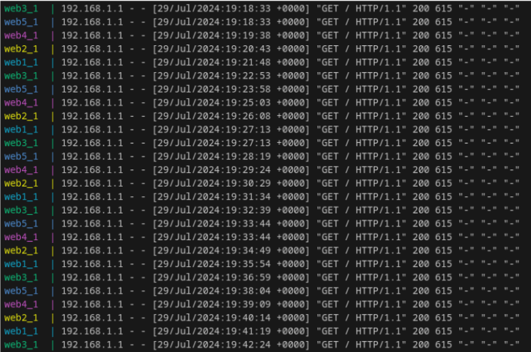

# README

## Projet fait depuis une distribution Debian 12 Bookworm

### Pré-requis pour faire tourner le projet

**Prérequis**

- Rust (version 1.60 ou supérieure)
- Cargo (gestionnaire de packages et outil de build pour Rust)
- Docker
- IDE (recommandée Visual Studio Code)

---

### Installation de Docker

```sh
sudo apt-get update
sudo apt-get install \
    ca-certificates \
    curl \
    gnupg \
    lsb-release
sudo mkdir -p /etc/apt/keyrings
curl -fsSL https://download.docker.com/linux/debian/gpg | sudo gpg --dearmor -o /etc/apt/keyrings/docker.gpg
echo \
  "deb [arch=$(dpkg --print-architecture) signed-by=/etc/apt/keyrings/docker.gpg] https://download.docker.com/linux/debian \
  $(lsb_release -cs) stable" | sudo tee /etc/apt/sources.list.d/docker.list > /dev/null
sudo apt-get update
sudo apt-get install docker-ce docker-ce-cli containerd.io docker-buildx-plugin docker-compose-plugin
sudo systemctl start docker
sudo systemctl enable docker
sudo usermod -aG docker $USER
newgrp docker
```

---

### Installation de Rust

```sh
curl --proto '=https' --tlsv1.2 -sSf https://sh.rustup.rs | sh
source $HOME/.cargo/env
```

---

### Installation de l'IDE recommandée (Visual Studio Code)

```sh
sudo apt update
sudo apt install software-properties-common apt-transport-https wget
wget -q https://packages.microsoft.com/keys/microsoft.asc -O- | sudo apt-key add -
sudo add-apt-repository "deb [arch=amd64] https://packages.microsoft.com/repos/vscode stable main"
sudo apt update
sudo apt install code
```

---

### Télécharger une version récente de Docker-compose

```sh
sudo curl -L "https://github.com/docker/compose/releases/download/v2.21.0/docker-compose-$(uname -s)-$(uname -m)" -o /usr/local/bin/docker-compose

sudo chmod +x /usr/local/bin/docker-compose

docker-compose --version
```

---

### Tests

Une fois les installations faites, procéder aux tests pour voir si tout fonctionne :

#### Étape 1 : Lancement des instances serveurs web

```sh
~/load_balancert/servers$ docker-compose up
```

(bloque le terminal pour visualiser les logs)

#### Étape 2 : Lancement du load balancer

```sh
~/load_balancer/load_balancer$ cargo run
```

#### Étape 3 : Vérification de la connectivité - Simulation des requêtes clients

- **Test individuel**
  ```sh
  curl http://localhost:8080
  ```

- **Test en masse**
  ```sh
  wrk -t12 -c400 -d30s http://localhost:8080
  ```

- **Test unitaire**
  Voir la documentation Rust.

**Options de wrk :**

- `-c, --connections <N>` : Nombre de connexions à garder ouvertes
- `-d, --duration <T>` : Durée du test (en secondes)
- `-t, --threads <N>` : Nombre de threads à utiliser

---

## Documentation du Load Balancer en Rust

### Introduction

Ce projet est un load balancer en Rust capable de distribuer des requêtes HTTP entrantes vers un ensemble de serveurs web en utilisant deux algorithmes de répartition de charge : Round Robin et Random. Ce load balancer est conçu pour équilibrer la charge entre 5 serveurs web, garantissant ainsi une répartition efficace des requêtes et une meilleure gestion des ressources.

### Fonctionnalités

- **Algorithme Round Robin** : Distribue les requêtes de manière circulaire parmi les serveurs disponibles.
- **Algorithme Random** : Sélectionne aléatoirement un serveur parmi les serveurs disponibles pour chaque requête.
- **Algorithme Least Connection** : Distribue les requêtes vers le serveur qui a le moins de connexions actives à un instant T.

---

### Round Robin

Dans notre projet, nous avons 5 serveurs web, le load balancer renvoie les requêtes vers ces mêmes serveurs web en s’appuyant sur l'algorithme Round Robin.

Les requêtes forwardées depuis le load balancer suivent cet ordre :

- requête 1
  vers → web3_1
- requête 2
  vers → web5_1
- requête 3
  vers → web4_1
- requête 4
  vers → web2_1
- requête 5
  vers → web1_1
- requête 6
  vers → web3_1

### Retour de simulation côté serveur web


---

### Health Check

Lors du lancement du load balancer avec `cargo run`, une entrée utilisateur permet de sélectionner l’algorithme à utiliser (ici Random). Ensuite, un premier retour de l'état de santé des serveurs web actifs est affiché, issu de la fonction `performance_health_check` dans le fichier `main.rs`.

Un check périodique de l’état des serveurs web est également effectué, issu de la fonction `start_health_check` dans le fichier `main.rs`.

---

### Random

Dans notre projet, nous avons 5 serveurs web, le load balancer renvoie les requêtes vers ces serveurs web de manière aléatoire en utilisant l'algorithme Random.

Les requêtes forwardées depuis le load balancer arrivent sur le serveur web aléatoirement :

- requête numéro X
  vers → webX_1 (X à remplacer par 1, 2, 3, 4 ou 5 en fonction du serveur sélectionné aléatoirement)

### Retour de simulation côté serveur web

Sur cette capture d’écran, on peut voir que les serveurs cibles ne suivent pas un ordre périodique.

---

## Contributions

Les contributions sont les bienvenues ! Pour contribuer, veuillez suivre les étapes suivantes :

1. Forker le dépôt.
2. Créer une branche pour votre fonctionnalité ou correctif.
3. Soumettre une pull request avec une description détaillée de vos modifications.

## Licence

Ce projet est sous la licence MIT. Voir le fichier LICENSE pour plus de détails.

## Support

Pour toute question ou problème, veuillez ouvrir une issue sur le dépôt GitHub du projet.
```
